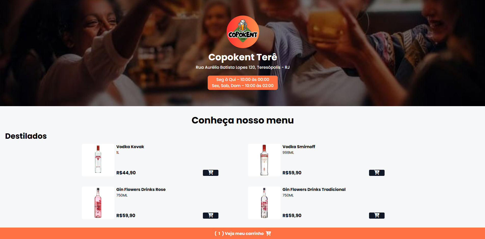
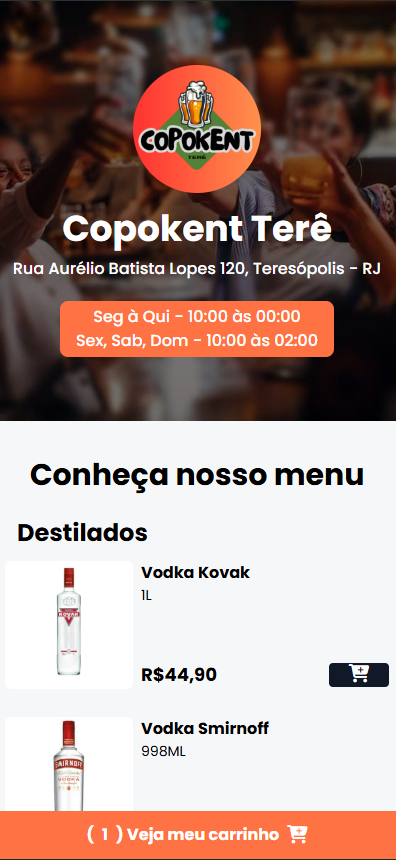
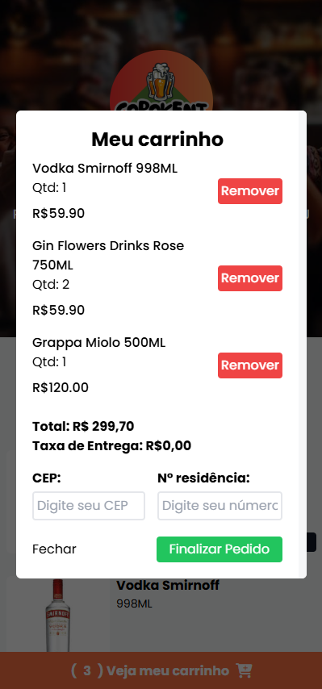

# CopoKent Terê - Online Drink Delivery Menu

**CopoKent Terê** is a real, fully functional online drink ordering platform developed for a local beverage delivery business located in Teresópolis - RJ, Brazil. This project is actively used by CopoKent to manage and process drink orders via WhatsApp, providing a seamless experience for both the business and its customers.

## 🛠️ Built With

- **HTML**
- **CSS**
- **JavaScript**
- **TailwindCSS**

## 📱 Features

- 🍻 **Responsive Online Menu**  
  Browse through a modern, mobile-friendly menu of distilled beverages.

- 🛒 **Smart Cart System**  
  Add products to your cart with a simple click. Quantities are managed dynamically.

- 📍 **Automatic Delivery Fee Calculation**  
  After entering the ZIP code (CEP), the system calculates the delivery fee based on the user's neighborhood in **Teresópolis - RJ**.

- 💬 **WhatsApp Integration**  
  When the user finalizes their order, they are redirected to CopoKent’s WhatsApp with a pre-filled message containing:
  - Full order summary
  - Total amount
  - Customer address details

## 📸 Screenshots

### Desktop Version

### Mobile Menu View

### Cart View on Mobile

## 📍 Location Specific

This project is customized for **Teresópolis - RJ** and only functions with ZIP codes from this region.

## 🚀 How It Works

1. Customer opens the site and browses the menu.
2. Adds desired items to the cart.
3. Enters ZIP code and house number.
4. The system calculates the delivery fee.
5. On clicking "Finalize Order", WhatsApp is opened with the full order message ready to send.

## 📞 Developed For

**CopoKent Terê**  
Rua Aurélio Batista Lopes 120, Teresópolis - RJ  
🕒 Mon to Thu: 10:00 – 00:00  
🕒 Fri, Sat, Sun: 10:00 – 02:00

---

> This project was created to help local businesses streamline their delivery operations with a simple yet powerful digital tool.

